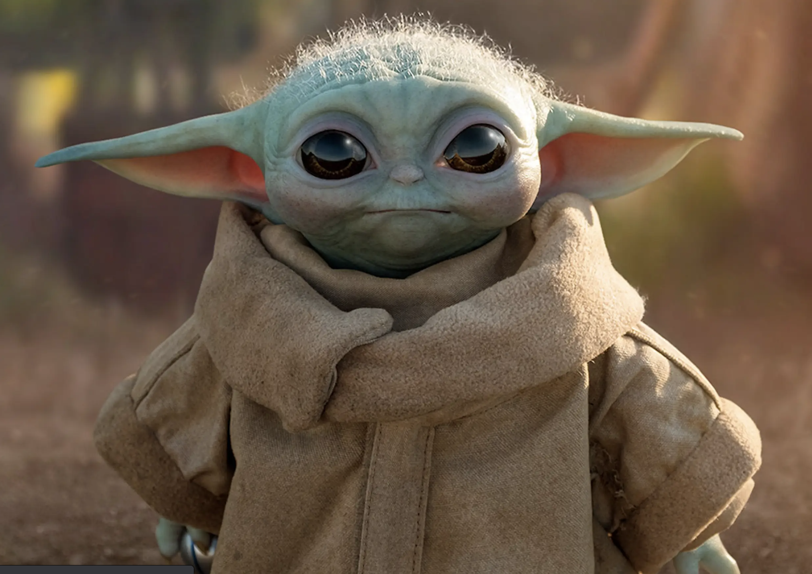
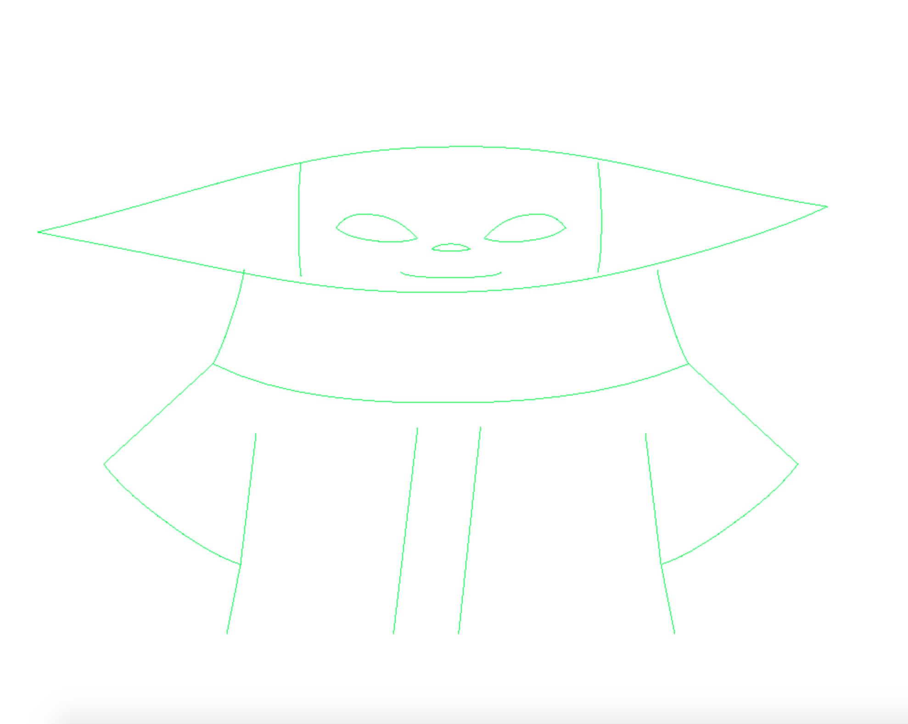
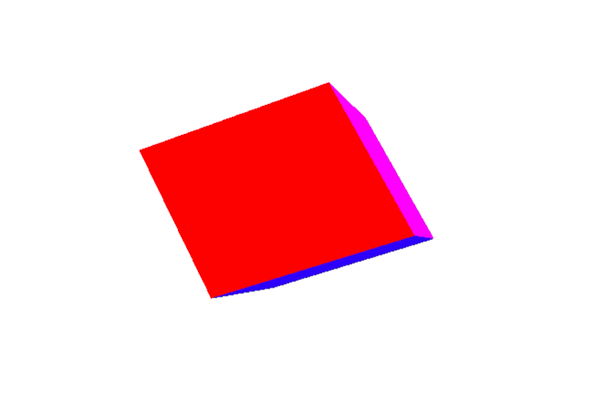

# Graphics
Coursework from CMSI 371: Graphics completed at LMU

## Assignement #1: Cartoonify
I used Bezier's algorithm to draw multiple curves that will form an image. A user is able to input points that will be used in the algorithm to transform points to a line and finally, into a curve. I inputted points for an image of Baby Yoda I found online, and found that Bezier's curve algorithm rendered the points better than Chaikin's algorithm would have, since Chaikin's algorithm does not keep endpoints in its iterations. 

Coded in C++ on Xcode using openGL and GLUT frameworks.

| original image | coded image |
| --- | --- |
|  |  |

## Assignement #2: Rotate Cube
This project was to rotate a cube around the x, y, and z axes. This invovles knowledge and implementation of rotation matrices of the x, y, and z, axes, a matrix multiplication function, and converting points back and forth between Cartesian coordinates and homogeneous coordinates.

Coded in C++ on Xcode using openGL and GLUT frameworks.

## Assignement #3: 3D Model
This assignment uses rotation matrices around the x, y, and z axes as well as a scaling and translation matrix to create objects in a scene. This begins with a rendering of a cube, created by making one plane, and duplicating that plane by rotating and translating to get all six cube faces.

Coded in C++ on Xcode using openGL and GLUT frameworks.

